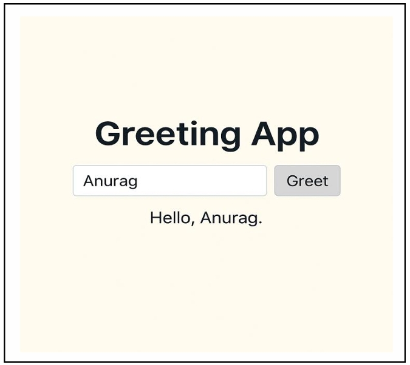

## OUTPUT  

1. Go to the project root folder: 
   mvn spring-boot:run 
 
2. Open browser at http://localhost:8080/ 
 
3. When the page loads: 
   Greeting App  
   [ Input box ]  [Greet button]  
   If you enter Anurag and click Greet, the page shows:  
   Hello, Anurag!

4. Image:

   

